<p align="center">
  <h1 align="center">⚡ QC2015P Charging Communication Protocol Local Test Platform</h1>
  <p align="center"><b>GB/T 27930.2-2024 Standard · Dual-end EVSE & EV Simulation · One-click Launch</b></p>
  <p align="center">
    
    
    
    
    
  </p>
</p>

<p align="center">
  <a href="README.md">🇨🇳 中文</a> | <b>🇬🇧 English</b>
</p>

---

## 🎬 Demo Video

<p align="center">
  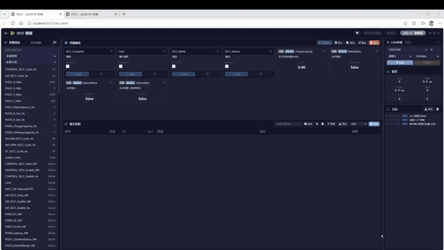
</p>

<details>
<summary>📥 Download Original HD Video (1080p MP4)</summary>

Download the original recording from the [Releases](https://github.com/Miki-Hunter/QC2015P_Platform/releases) page.

</details>


## 📖 What Is This?

In one sentence: **A single PC + a CAN adapter can fully simulate the entire charging communication process between an EVSE (charger) and an EV in the lab.**

```
┌──────────────────────────────────────────────────────────┐
│                    Your PC (Windows)                      │
│                                                          │
│   ┌─────────────────────────────────────────────────┐    │
│   │            QC2015P Test Platform (exe)          │    │
│   │                                                 │    │
│   │   ┌───────────┐       ┌───────────┐            │    │
│   │   │  SECC Model│       │  EVCC Model│           │    │
│   │   │ (EVSE Side)│       │ (EV Side)  │           │    │
│   │   └─────┬─────┘       └─────┬─────┘            │    │
│   │         └──────────┬────────┘                   │    │
│   │              CAN Bus Communication              │    │
│   └────────────────────┼────────────────────────────┘    │
│                        │ USB                             │
│              ┌─────────┴─────────┐                       │
│              │   ZLG USBCAN2     │                       │
│              │   CAN Adapter      │                       │
│              └───────────────────┘                       │
└──────────────────────────────────────────────────────────┘
```

### 🤔 Why Do You Need It?

| Traditional Approach | This Platform |
|---------------------|---------------|
| Requires real EVSE + real vehicle | Simulate both ends with one PC |
| Test conditions limited by hardware | Modify parameters freely, reproduce anomalies quickly |
| Cannot replay historical messages | 100K message buffer + ASC/BLF recording & export |
| Recompile firmware for every code change | Modify parameters in real-time via Web UI, effective in ms |
| Read messages by eye | DBC auto-decoding, color-coded at a glance |

---

## 🌟 Key Highlights

<table>
<tr>
<td width="50%" valign="top">

### 🚗🔌 Dual-Model Parallel Simulation
SECC (EVSE) and EVCC (vehicle) run **simultaneously**, each with independent 1ms fixed-step, communicating via CAN bus in real-time, forming a complete charging closed loop.

</td>
<td width="50%" valign="top">

### 📊 Real-time Visualization
Browser-based Web UI with **real-time parameter read/write**, **real-time message tracing**, **real-time charging phase indication** — all statuses at a glance.

</td>
</tr>
<tr>
<td width="50%" valign="top">

### 🔧 Changes Take Effect Instantly
Drag parameters to the canvas, modify values, click "Apply" — **effective in milliseconds**, no restart, no recompilation.

</td>
<td width="50%" valign="top">

### 🐍 Python Automation
Control via HTTP API — read/write parameters, read messages with one line of code. **Easily write automated test scripts**.

</td>
</tr>
<tr>
<td width="50%" valign="top">

### 📝 Message Recording & Playback
Supports **ASC** (open directly in CANoe) and **BLF** (Vector binary) recording formats for post-analysis.

</td>
<td width="50%" valign="top">

### 🎨 Dark / Light Theme
Two built-in themes — **dark tech style** for demos, **light clean style** for daily development, switch with one click.

</td>
</tr>
</table>

---

## 🖥️ Interface Overview

### Home Page

<p align="center">
  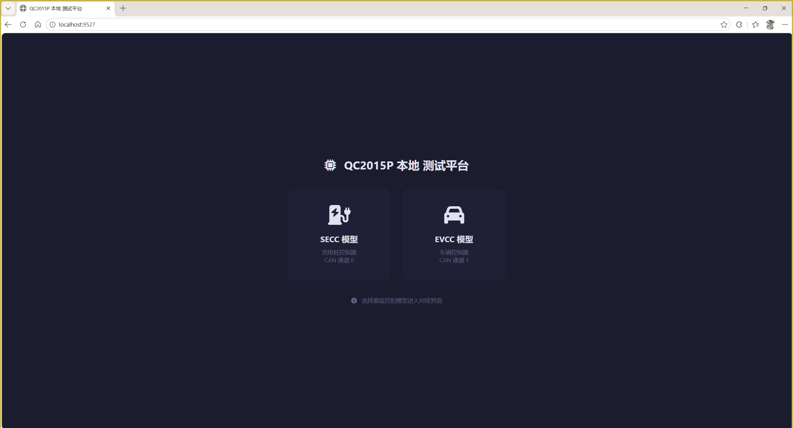
  <br/><em>▲ Home — Select SECC (EVSE side) or EVCC (vehicle side) test page</em>
</p>

### SECC Page (EVSE Side) — Full View

<p align="center">
  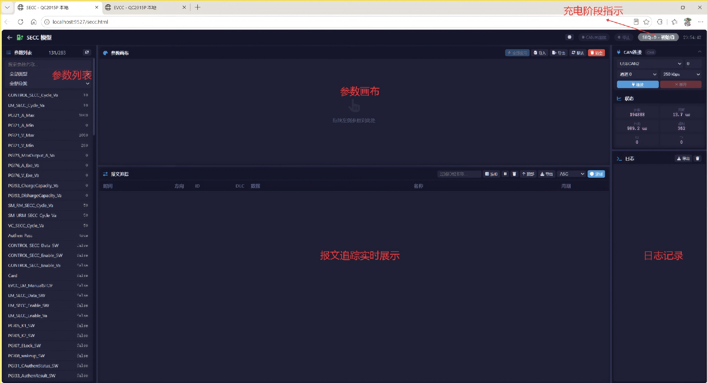
  <br/><em>▲ SECC Page — Top: charging phase indicator + Left: parameter list + Center: parameter canvas + Bottom: message trace</em>
</p>

### EVCC Page (Vehicle Side) — Full View

<p align="center">
  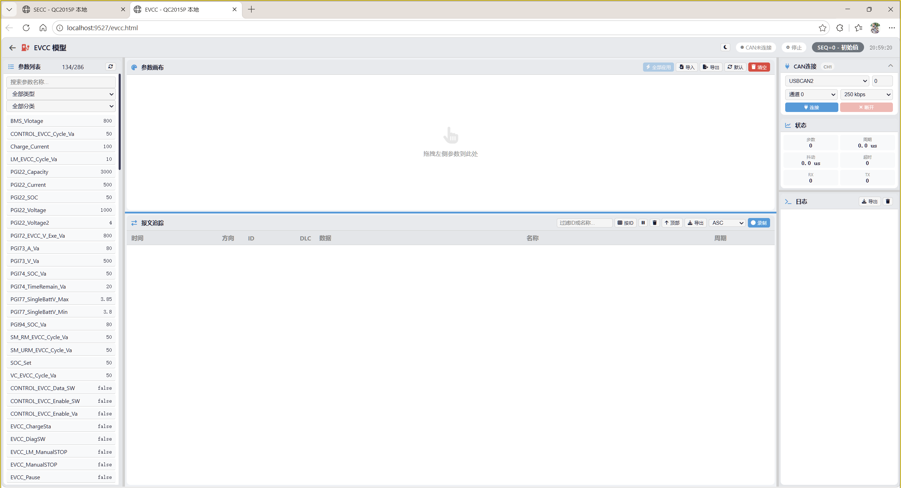
  <br/><em>▲ EVCC Page — Layout matches SECC, parameters and messages correspond to the vehicle side</em>
</p>

---

## 🔍 Feature Details (With Screenshots)

### 1️⃣ Real-time Charging Phase Indicator

The top navigation bar displays the current charging phase in real-time, with colors changing automatically:

<p align="center">
  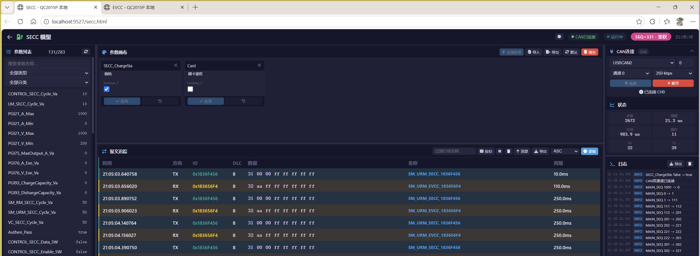
  <br/><em>▲ Top SEQ badge — Current phase: "Authentication", pink background</em>
</p>

Full charging phase color map:

| Phase | SEQ Value | Color |
|:------|:---------:|:-----:|
| Initial | 0 | 🩶 Gray |
| Version Negotiation | 1 | 🩵 Cyan |
| Function Negotiation | 2~202 | 💙 Blue |
| Parameter Configuration | 203~302 | 💜 Purple |
| **Authentication** | **303~402** | **💗 Pink** |
| Reservation | 403~502 | ❤️ Rose |
| Output Circuit Detection | 503~602 | 🧡 Orange |
| Power Supply Mode | 603~702 | 🟠 Dark Orange |
| Pre-charge & Energy Transfer | 703~777 | 💚 Green |
| Charging Pause | 778~780 | 💛 Yellow |
| Charging Termination | 781~800 | ❤️ Red |
| Charging Complete | 801~900 | 🩵 Teal |

### 2️⃣ Parameter Canvas — Drag & Drop Editing

Drag parameters from the left list to the canvas area to **view and modify** values in real-time:

<p align="center">
  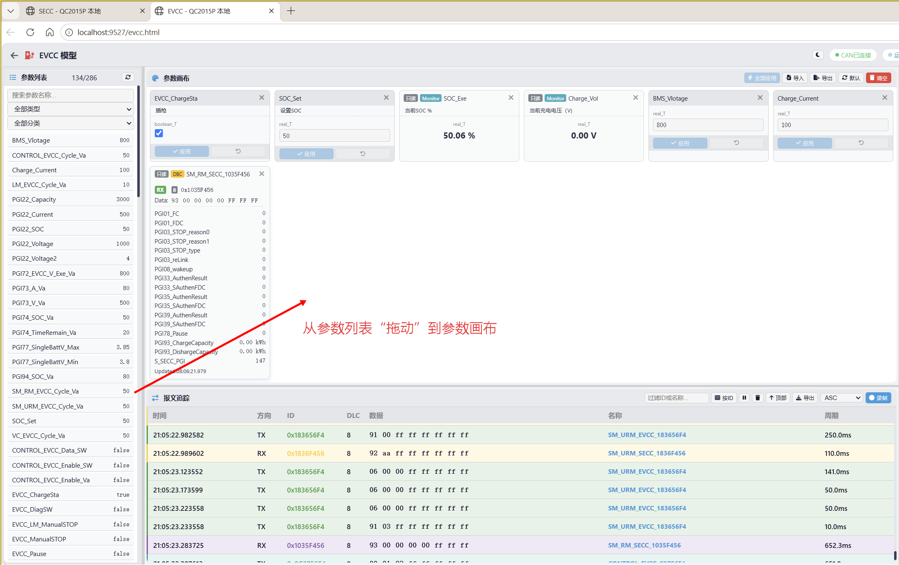
  <br/><em>▲ Parameter Canvas — Drag parameter cards to canvas, edit values in real-time, gray text shows notes</em>
</p>

**Three parameter types supported:**

| Type | Editable | Description |
|:-----|:--------:|:------------|
| 🔧 Model Parameters | ✅ Read/Write | Simulink model internal variables, effective immediately after modification |
| 📡 DBC Signals | 👁️ Read-only | CAN message signal values, auto-decoded from DBC file |
| 📊 Monitor Variables | 👁️ Read-only | Model output monitoring variables |

**Convenient Operations:**
- 🖱️ **Drag to Add** — Drag from left list to canvas
- ✏️ **Click to Edit** — Click values on cards to modify directly
- 📋 **Apply All** — Batch submit all modifications at once
- 💾 **Import/Export** — Save canvas configuration as JSON for next use
- 📌 **Default Config** — Pre-configured common parameters, shown on startup

### 3️⃣ Message Trace — 15-Color Identification

CAN message real-time tracing with **different message IDs automatically assigned different colors**:

<p align="center">
  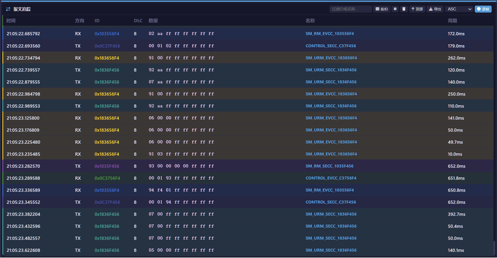
  <br/><em>▲ Message Trace — 15 colors assigned by ID, with color bar + ID text + subtle background</em>
</p>

**Core Capabilities:**
- 📦 **100K Message Buffer** — Both backend and frontend retain 100K messages, virtual scrolling smooth
- 🔍 **Real-time Filtering** — Quick filter by ID or name
- ⬆️ **Scroll Up to Review** — Auto-load earlier history when scrolling to top
- 🖱️ **Click to Decode** — Click any message row to see DBC signal decode details
- ⏱️ **Message Period** — Auto-calculate send period for each message

### 4️⃣ Recording & Export

<p align="center">
  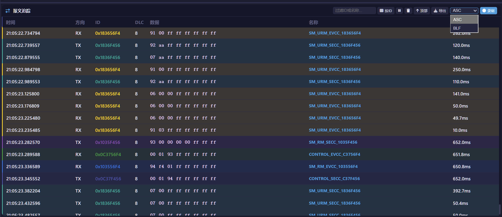
  <br/><em>▲ Recording Control — Select ASC or BLF format, one-click start/stop recording</em>
</p>

| Format | Description | Tool |
|:-------|:------------|:-----|
| **ASC** | Text format, human-readable | Open directly in CANoe / CANalyzer |
| **BLF** | Vector binary format, smaller files | CANoe / CANalyzer / Python |

### 5️⃣ Parameter List — Three in One

<p align="center">
  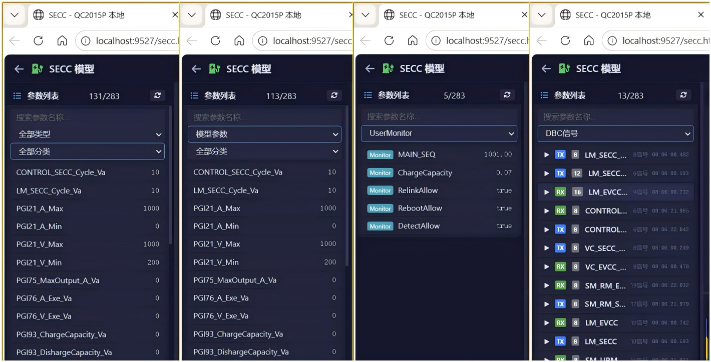
  <br/><em>▲ Parameter List — Model parameters, DBC signals, Monitor variables unified display</em>
</p>

### 6️⃣ Dark / Light Theme

<p align="center">
  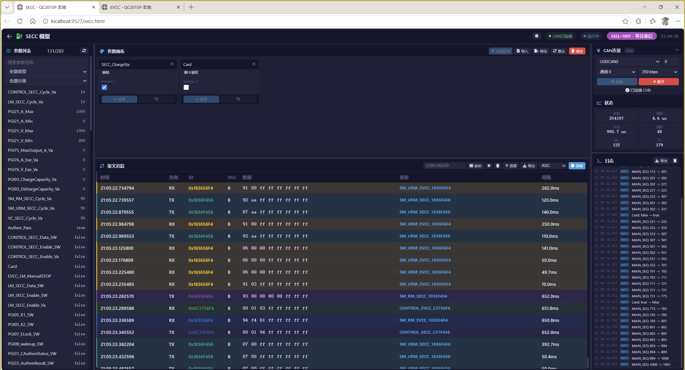
  &nbsp;&nbsp;
  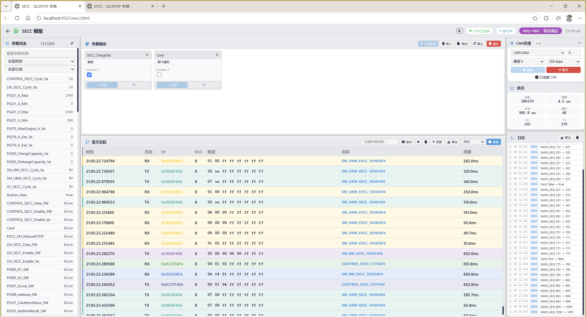
  <br/><em>▲ Left: Dark theme (tech style, for demos) | Right: Light theme (clean, for daily use)</em>
</p>

---

## 🏗️ System Architecture

```
┌─────────────────────────────────────────────────────────────────────┐
│                       Browser (Chrome / Edge)                        │
│                                                                     │
│   ┌──────────┐   ┌──────────┐   ┌──────────┐   ┌──────────┐       │
│   │   Home   │   │ SECC Page│   │ EVCC Page│   │  Canvas  │       │
│   │          │   │          │   │          │   │  Trace   │       │
│   └────┬─────┘   └────┬─────┘   └────┬─────┘   └──────────┘       │
│        └───────────────┼──────────────┘                             │
│                        │ HTTP API (JSON)                             │
└────────────────────────┼────────────────────────────────────────────┘
                         │
┌────────────────────────┼────────────────────────────────────────────┐
│                   C++ Backend (QC2015P_HIL.exe)                      │
│                        │                                             │
│   ┌────────────────────┴────────────────────────────────────────┐   │
│   │                  HTTP Server (Port 9527)                     │   │
│   │   Param R/W │ DBC Decode │ Trace │ Script Queue │ Recording │   │
│   └──────┬──────────────┬──────────────┬────────────────────────┘   │
│          │              │              │                             │
│   ┌──────┴──────┐ ┌─────┴──────┐ ┌────┴──────┐                     │
│   │  SECC Model  │ │  EVCC Model │ │ CAN Driver│                    │
│   │  CPU2 Bound  │ │  CPU4 Bound  │ │ZLG USBCAN2│                   │
│   │  1ms Step    │ │  1ms Step    │ │ Dual Ch   │                    │
│   └──────┬──────┘ └─────┬──────┘ └────┬──────┘                     │
│          │              │              │                             │
│   Simulink Coder  Simulink Coder   CAN Bus                         │
│   Generated C++   Generated C++   (Ch0=SECC, Ch1=EVCC)             │
└─────────────────────────────────────────────────────────────────────┘
```

### Data Flow

```
CAN Hardware ──→ CAN Driver ──→ Message Buffer ──→ Frontend Polling Display
                    │
                    ├──→ DBC Signal Decode ──→ Frontend Parameter Update
                    │
                    └──→ Long Msg Assembly ──→ PGI Complete Message ──→ Display

Frontend Param Edit ──→ HTTP API ──→ Model Memory Write ──→ Effective in 1ms
```

---

## 🚀 Quick Start

### 📋 Prerequisites

| Dependency | Description | Required |
|:-----------|:------------|:--------:|
| **ZLG USBCAN2** | CAN adapter hardware | ✅ |
| **Windows 10/11** | Operating system | ✅ |
| **Chrome / Edge** | Browser | ✅ |

### ▶️ Usage Steps

This repository provides **pre-compiled executables** — no build environment needed.

**Step 1: Download**

Download the `build` folder from this repository, or download the packaged archive from the [Releases](https://github.com/Miki-Hunter/QC2015P_Platform/releases) page.

**Step 2: Connect CAN Hardware**

Plug in ZLG USBCAN2 via USB, ensure drivers are installed.

**Step 3: Launch**

```
Enter the build folder, double-click QC2015P_HIL.exe
```

> ⚠️ Ensure all files in the `build` directory (DLLs, web folder, model folder, DBC file) remain intact — the program reads these resources at runtime.

**Step 4: Access in Browser**

After startup, open in browser:

| Page | URL | Description |
|:-----|:----|:------------|
| 🏠 Home | http://localhost:9527 | Navigation entry |
| 🔌 SECC | http://localhost:9527/secc.html | EVSE side testing |
| 🚗 EVCC | http://localhost:9527/evcc.html | Vehicle side testing |

---

## 🐍 Python Automation (Optional)

The repository includes a Python client library — zero dependencies, ready to use.

### Quick Example

```python
import sys
sys.path.insert(0, "docs")
from qc2015p_client import SECC_ValueSet, SECC_ValueGet, EVCC_ValueGet, MsgGet, connect

# Connect CAN (dual channel)
connect(baud=250000)

# Set EVSE parameter (one line)
SECC_ValueSet("ChargeSta", 1)

# Read vehicle parameter
val = EVCC_ValueGet("ChargeSta")
print(f"EVCC charging status: {val}")

# Read CAN message signal
soc = MsgGet(0x1836F456, "PGI05_K1")
print(f"SOC value: {soc}")
```

### API Quick Reference

| Function | Description | Example |
|:---------|:------------|:--------|
| `connect(baud)` | Connect CAN dual channel | `connect(baud=250000)` |
| `SECC_ValueSet(name, val)` | Set SECC parameter | `SECC_ValueSet("ChargeSta", 1)` |
| `SECC_ValueGet(name)` | Read SECC parameter | `SECC_ValueGet("ChargeSta")` |
| `EVCC_ValueSet(name, val)` | Set EVCC parameter | `EVCC_ValueSet("ChargeSta", 1)` |
| `EVCC_ValueGet(name)` | Read EVCC parameter | `EVCC_ValueGet("ChargeSta")` |
| `MsgGet(id)` | Read full message info | `MsgGet(0x1836F456)` |
| `MsgGet(id, signal)` | Read single signal | `MsgGet(0x1836F456, "PGI05_K1")` |
| `logging(state, ch, fmt)` | Recording control | `logging(1, ch=0, fmt=1)` |
| `get_trace(model)` | Get message trace | `get_trace("SECC")` |

> 📄 Full API documentation: [docs/API.md](docs/API.md) | Source code: [docs/qc2015p_client.py](docs/qc2015p_client.py)

---

## 📁 File Structure

```
QC2015P_Platform/
│
├── 📂 build/                        ← Compiled output (run directly)
│   ├── QC2015P_HIL.exe              ← Main program
│   ├── *.dll                        ← Runtime dependencies (GCC / USBCAN / binlog)
│   ├── 27930_2024_MIX.dbc           ← DBC signal definition file
│   ├── 📂 web/                      ← Frontend pages (built)
│   │   ├── index.html               ← Home page
│   │   ├── secc.html                ← SECC page
│   │   ├── evcc.html                ← EVCC page
│   │   └── assets/                  ← JS/CSS resources
│   ├── 📂 model/                    ← Simulink model headers
│   │   ├── secc/                    ← SECC model headers
│   │   └── evcc/                    ← EVCC model headers
│   └── 📂 Logger/                   ← Message recording output
│       └── canvas/                  ← Canvas default config
│
├── 📂 docs/                         ← Documentation, scripts & screenshots
│   ├── API.md                       ← HTTP API reference
│   ├── qc2015p_client.py            ← Python client library (zero deps)
│   ├── demo.py                      ← Demo script
│   └── screenshots/                 ← UI screenshots (10 images)
│
├── 📄 README.md                     ← Chinese README
├── 📄 README_EN.md                  ← English README (this file)
└── 🎬 演示视频_compressed.mp4        ← Demo video (1080p 60fps, 26MB)
```

---

## 🔧 Tech Stack

<table>
<tr>
<td align="center" width="120">
  <br/>
  <b>C++ 17</b><br/>Backend Core
</td>
<td align="center" width="120">
  <br/>
  <b>Vue.js 3</b><br/>Frontend UI
</td>
<td align="center" width="120">
  <br/>
  <b>Vite 5</b><br/>Build Tool
</td>
<td align="center" width="120">
  <br/>
  <b>Python 3</b><br/>Automation
</td>
<td align="center" width="120">
  <br/>
  <b>Simulink</b><br/>Model Design
</td>
</tr>
</table>

| Layer | Technology | Description |
|:------|:-----------|:------------|
| **Frontend** | Vue.js 3 + Vite 5 | Responsive SPA, dark/light theme |
| **Backend** | C++ 17 + MinGW-w64 | High-performance HTTP server, 1ms fixed-step |
| **CAN** | ZLG USBCAN2 DLL | Dual-channel CAN transceiver |
| **Model** | Simulink Coder | Auto-generated C++ code |
| **Protocol** | GB/T 27930-2024 | New national standard charging communication protocol |
| **DBC** | CANdb++ format | Signal definition, multiplexing support |

---

## ❓ FAQ

<details>
<summary><b>Q: Double-clicking exe does nothing?</b></summary>

Try running from command line to see error messages. Common causes:
1. Missing DLLs — Ensure all DLL files in the `build` directory are intact
2. Port occupied — Ensure port 9527 is not used by another program
</details>

<details>
<summary><b>Q: CAN connection failed?</b></summary>

Ensure **no other CAN software** (e.g., CANoe, USBCAN tools) is using the same device. ZLG USBCAN2 does not support multiple software opening simultaneously.
</details>

<details>
<summary><b>Q: Parameter changes not taking effect?</b></summary>

1. Ensure you clicked the "**Apply**" button
2. Ensure the corresponding **Enable** parameter is set to `true`
3. Ensure the model is running (CAN connected)
</details>

<details>
<summary><b>Q: Browser page is blank?</b></summary>

1. Ensure the `build/web` directory is complete
2. Ensure the program has started without errors
3. Try clearing browser cache and refreshing
</details>

---

## 📄 Related Documentation

- [HTTP API Reference](docs/API.md) — Complete API interface documentation
- [Python Client Library](docs/qc2015p_client.py) — Zero dependencies, import and use directly
- [Python Demo Script](docs/demo.py) — Full feature demo, run with `python demo.py`

---

<p align="center">
  <b>⚡ QC2015P Local Platform — Making Charging Communication Testing Simple ⚡</b>
  <br/><br/>
  For questions or suggestions, please contact the project maintainer.
</p>
